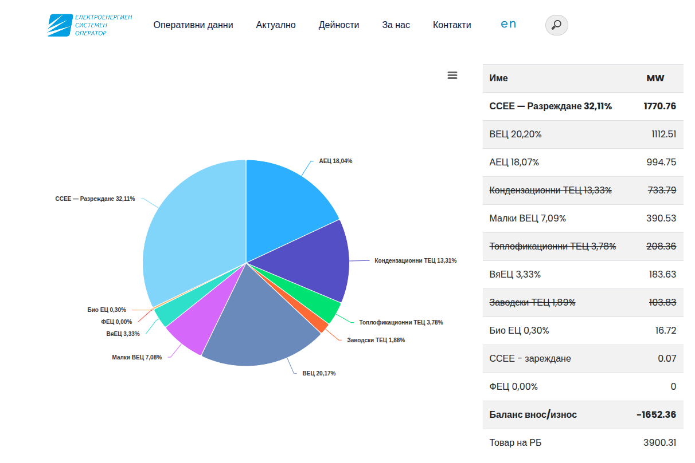

# ESO БГ — Батерии и Внос/Износ в Диаграмата

Разширение за Chrome, което подобрява диаграмата за генерация на [eso.bg](https://www.eso.bg/doc/?460) с няколко допълнителни функции.

## Функции

- **Батерии (ССЕЕ) в диаграмата** — Показва скритото разреждане на батериите като отделен светлосин сектор в питейната диаграма, с преизчислени проценти за всички източници.
- **Баланс внос/износ** — Получава данните от реалновременния SCADA API и добавя сектор „Внос" (лилав) когато България внася ток нетно. В таблицата се показва ред „Баланс внос/износ" с положителна стойност при внос и отрицателна при износ.
- **Преизчислени проценти** — Всички проценти в диаграмата се преизчисляват спрямо реалния общ обем (генерация + разреждане + нетен внос).
- **Сортирана таблица** — Редовете в таблицата се сортират по низходящ MW. „Баланс внос/износ" и „Товар на РБ" остават последни.
- **Зачертаване при износ** — При нетен износ, разширението зачертава най-малките топлоелектрически и ядрени централи (ТЕЦ и АЕЦ), чийто капацитет се покрива от износа — визуализира кои мощности са „излишни" в момента. Възобновяемите източници (ВЕЦ, ВяЕЦ, ФЕЦ, Био) не се зачертават.

## Инсталация

**1. Изтеглете разширението**

Натиснете зеления бутон **Code → Download ZIP** горе вдясно на тази страница. Разархивирайте папката на удобно място.

**2. Отворете страницата с разширения**

В адресната лента на Chrome напишете `chrome://extensions` и натиснете Enter.

**3. Включете режим за разработчици**

В горния десен ъгъл на страницата има превключвател **"Режим за разработчици"** (или "Developer mode" ако Chrome е на английски). Включете го — ще се появят три нови бутона.

**4. Заредете разширението**

Натиснете **"Зареди разпакетирано"** (Load unpacked) → намерете и изберете разархивираната папка → натиснете OK.

Разширението се появява в списъка с иконка на пъзел.

**5. Отворете eso.bg**

Отидете на [eso.bg/doc/?460](https://www.eso.bg/doc/?460). Промените се появяват автоматично.

---

Разширението не изпраща никакви данни и не изисква никакви права.
